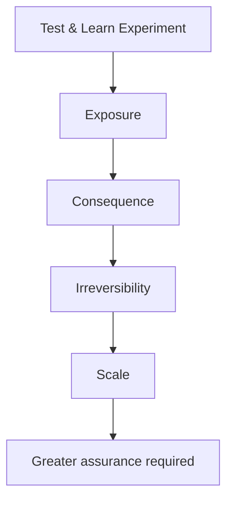

# Proportional assurance

Assurance grows with consequence.

<strong>Assurance increases with exposure, consequence, irreversibility and scale — not simply because a project has reached another governance stage.</strong>

A Test & Learn Experiment may legitimately involve real users and real operational environments. Its scope and blast radius should be understood and bounded.

A technically small experiment involving sensitive data could still require significant assurance.

Proportional assurance is based on risk and consequence rather than bureaucracy.

## Questions to ask as exposure increases

- Are more people affected?
- Is more sensitive or valuable data involved?
- Are decisions harder to reverse?
- Is operational dependency increasing?
- Are costs or supplier commitments becoming longer term?
- Does failure now create a materially larger consequence?

Strengthen the architecture and controls in response to those answers, not an arbitrary project stage.
