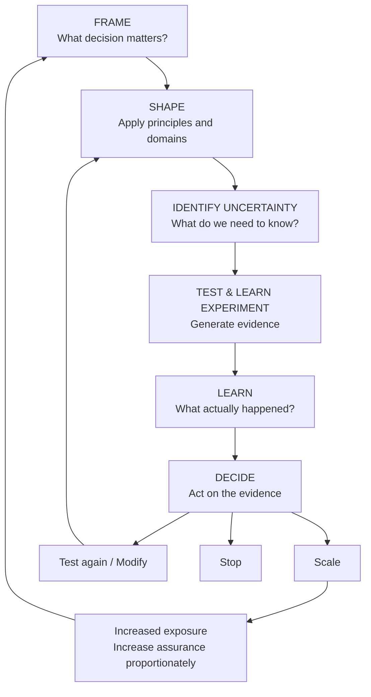

# Continuous Architecture

Architecture changes as the evidence changes.

Architecture does not finish when an experiment is approved.

As evidence changes, the architecture can change. As an intervention scales, architectural concerns change. As risks become real or are disproven, controls can change.

## Frame

What decision matters? Avoid beginning with a preferred solution.

## Shape

Use the [principles](../principles/) and [domains](../domains/) to understand the problem and identify the decisions that need architectural attention.

## Identify uncertainty

Find the assumptions that could materially change the next decision.

## Test & Learn Experiment

Design a bounded intervention that can create useful evidence.

## Learn

Compare what happened with what was assumed.

## Decide

Scale, test again, modify or stop. Then repeat the loop as the level of commitment and exposure changes.
