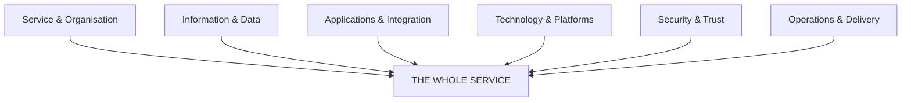

# Architecture domains

Lenses, not silos.

The domains help us consider the **whole service**. They are not six architecture practices and they are not six governance teams.

| Domain | Primary question |
| --- | --- |
| [Service & Organisation](service-organisation.md) | What does this mean for the service? |
| [Information & Data](information-data.md) | What data does it create or depend upon? |
| [Applications & Integration](applications-integration.md) | What does it integrate with? |
| [Technology & Platforms](technology-platforms.md) | What technology and platforms does it rely upon? |
| [Security & Trust](security-trust.md) | How do we create trust and manage risk? |
| [Operations & Delivery](operations-delivery.md) | Who operates, supports and ultimately owns it? |

We apply the domains <strong>proportionately to the decision</strong> we are trying to make.

A short experiment does not need a five-year operating model. But if operational ownership could invalidate the proposition, explore it during the experiment.
