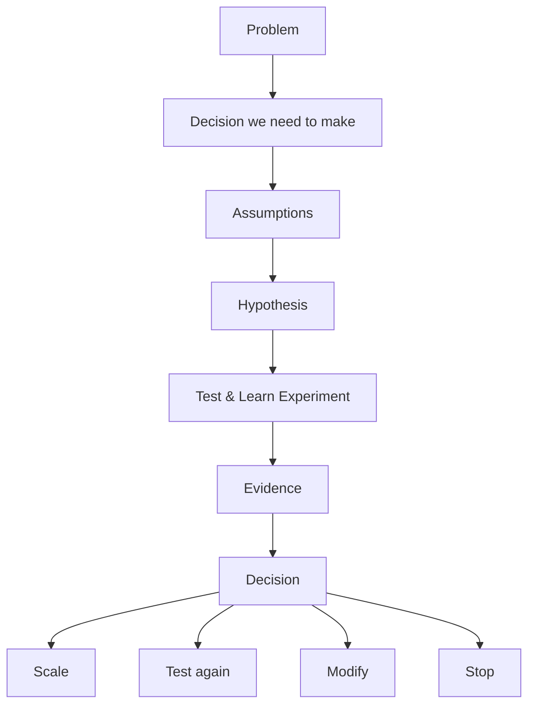

CustomerFirst Technology & Architecture

# Architecture at CustomerFirst

Architecture creates confidence to make the next decision.

**Not a gate. Not a phase. Not a document.**

CustomerFirst uses architecture to help teams understand uncertainty, make proportionate technology decisions and safely learn what should happen next.

Architecture is a continuous capability. It helps teams decide what they need to understand now, what they can safely defer, what they should test, and whether the evidence supports increasing their commitment.

<strong>Architecture is not about proving that a design is correct.</strong> 
It is about creating enough confidence to make the next good decision.

## The four-part model

  
<strong>PRINCIPLES</strong>How we think

  
<strong>DOMAINS</strong>What we consider

  
<strong>THE NEXT GOOD DECISION</strong>

  
<strong>EVIDENCE</strong>What we know

  
<strong>ASSURANCE</strong>Enough confidence to act?

**Principles** tell us how to think. **Domains** ensure we consider the whole system. **Evidence** tells us what we actually know. **Assurance** determines whether we have enough confidence to act.

### [Principles](principles/)
Decision-making tools that help teams make consistent choices without prescribing a single solution.

### [Domains](domains/)
Six lenses that help us consider the whole service without creating architecture silos.

### [Evidence](evidence/)
Turn important architectural assumptions into things that can be tested and learned from.

### [Assurance](assurance/)
Decide whether we understand enough about the risk and evidence to make the next move.

## Architecture in evidence-led delivery

Architecture helps us make the experiment <strong>safe enough to run</strong>, and the resulting decision <strong>strong enough to act on</strong>.

We are not architecting a complete solution and then testing whether it works. Architecture helps shape the mechanism through which we learn what should happen next.

## Test & Learn Experiment

A **Test & Learn Experiment** is a bounded intervention designed to create enough evidence to inform a decision. It may involve real users, real operational processes, real environments and — where appropriate — real data.

The important question is not whether the work resembles a traditional prototype or pilot. It is whether we understand the exposure, have appropriate guardrails and know what evidence we need.

[Use architecture in a Test & Learn Experiment →](test-and-learn/)

## The decisions we make

  
SCALE

  
TEST AGAIN

  
MODIFY

  
STOP

**Scale** when the evidence supports increasing commitment or exposure. **Test again** when important uncertainty remains. **Modify** when the evidence points to a different approach. **Stop** when further investment is not justified.

Stopping based on evidence is a valid outcome.

## Continuous architecture

Architecture changes as the evidence changes. We frame the decision, shape the intervention, identify uncertainty, test and learn, then act on what we have learned.

[See the continuous architecture model →](continuous-architecture/)
