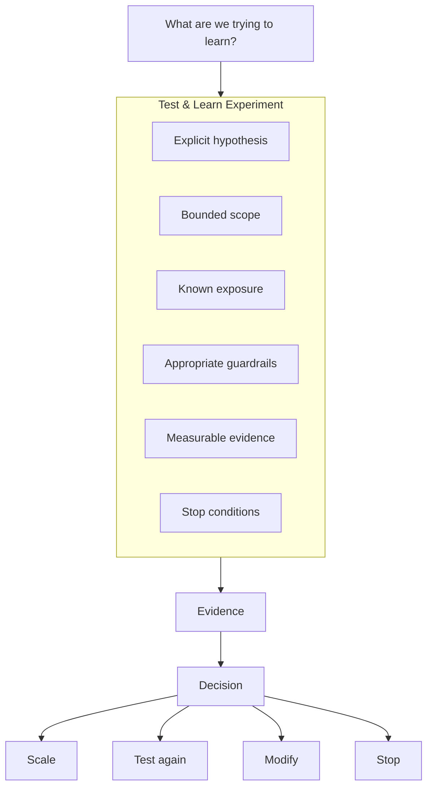

# Architecture in a Test & Learn Experiment

A bounded intervention through which uncertainty becomes evidence.

Do not separate **experiment** and **pilot** into different stages. CustomerFirst uses **Test & Learn Experiment** for the bounded intervention used to test a hypothesis and create evidence for a decision.

A Test & Learn Experiment can legitimately involve real users, real operational processes, real environments and real data where appropriate.

The important questions are:

- What are we trying to learn?
- What decision will this inform?
- What exposure are we creating?
- What could cause harm?
- What guardrails are required?
- What evidence would support continuing?
- What evidence would cause us to modify or stop?

<strong>Assurance</strong>Is this bounded experiment safe enough and useful enough to run?

## Explore further

- [Guardrails](guardrails.md)
- [Bounded risk and exposure](bounded-risk.md)
- [Stop conditions](stop-conditions.md)
- [Experiment architecture checklist](../patterns/experiment-checklist.md)
